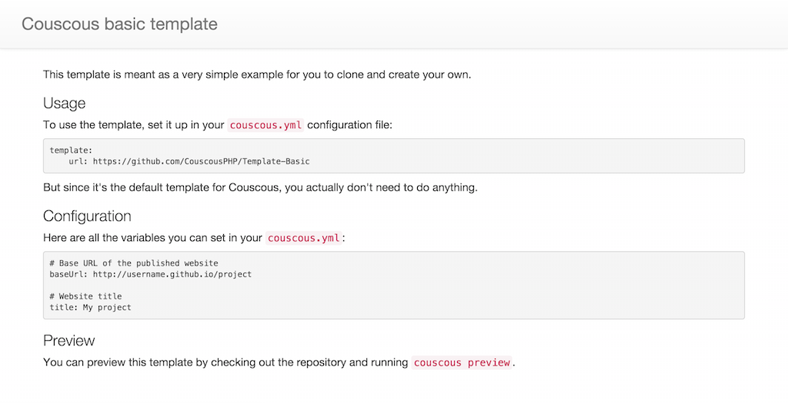

This [Couscous](http://couscous.io) template is meant as a very simple example for you to clone and create your own.

## Screenshot



## Usage

To use the template, set it up in your `couscous.yml` configuration file:

```yaml
template:
    url: https://github.com/CouscousPHP/Template-Basic
```

But since it's the default template for Couscous, you actually don't need to do anything.

## Configuration

Here are all the variables you can set in your `couscous.yml`:

```yaml
# Base URL of the published website
baseUrl: http://username.github.io/project

# Website title
title: My project
```

## Preview

You can preview this template by checking out the repository and running `couscous preview`.
